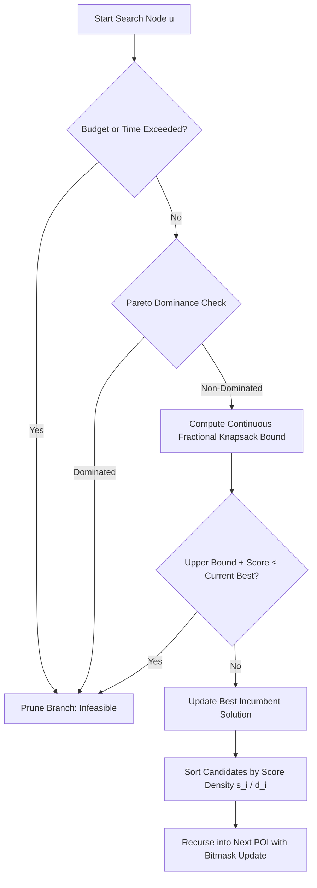

# Paladio Core (`paladio-core`)

**An ultra-fast, deterministic C++20 combinatorial routing engine with zero-copy Python bindings.**

[](https://en.cppreference.com/w/cpp/20)
[](https://www.python.org/)
[](LICENSE)
[](.github/workflows/ci.yml)
[](#zero-allocation-hot-path-architecture)
[](#benchmarks--performance-showcase)
[](https://leandro-juan.github.io/paladio-core/)

<p align="center">
  <a href="#quickstart">Quickstart</a> •
  <a href="#benchmarks--performance-showcase">Benchmarks</a> •
  <a href="#algorithmic-architecture">Algorithmic Architecture</a> •
  <a href="#zero-allocation-hot-path-architecture">Architecture Callout</a> •
  <a href="#documentation">Documentation</a> •
  <a href="#author--maintainer">Author</a> •
  <a href="#contributing">Contributing</a>
</p>

</div>

---

## Overview

Combinatorial tour planning over arbitrary metric graphs under simultaneous time windows and financial budgets—formally known as the **Time-Constrained Orienteering Problem with Time Windows (TCOPTW)**—is strongly NP-hard. Exploring every candidate permutation on an $N$-node graph requires evaluating $O(N!)$ trajectories, rendering brute-force or naive depth-first search (DFS) computational dead-ends for $N > 10$.

`paladio-core` is an industrial-strength, production-proven engine designed to solve TCOPTW instances in **microseconds to milliseconds**. By pairing a **Continuous Fractional Knapsack relaxation** with **64-bit integer bitmask state encoding** and **multi-criteria dominance pruning**, it discards over **99.999%** of the combinatorial search space before descending into suboptimal branches.

---

<a id="zero-allocation-hot-path-architecture"></a>
> ### ⚡ Zero-Allocation Hot-Path Architecture
> 
> High-throughput systems cannot tolerate heap contention, cache thrashing, or non-deterministic OS allocator latency. `paladio-core` implements strict systems-level guarantees:
> 
> - **$O(1)$ Bitmask State Transitions:** Visited nodes, mandatory milestones, and category sets are stored as 64-bit unsigned integers (`uint64_t`). Next-hop filtering and rank lookups leverage single-cycle CPU hardware intrinsics (`std::countr_zero`).
> - **Zero Dynamic Heap Allocations in Hot Loops:** DFS call frames, path tracking (`std::array<int, 64>`), and category frequency histograms (`std::array<uint8_t, 8>`) reside entirely on contiguous stack memory. No `malloc`, `new`, or heap-allocated reallocations occur during branch exploration.
> - **Sanitizer Clean:** 100% verified under Clang and GCC AddressSanitizer (ASan), LeakSanitizer (LSan), and UndefinedBehaviorSanitizer (UBSan).
> - **GIL-Free Python Concurrency:** All computational hot loops release the Python Global Interpreter Lock (`pybind11::gil_scoped_release`), allowing pure multi-threaded C++ scaling across CPU cores.

---

## Operations Research Rigor: Optimality Guarantees

`paladio-core` handles both mathematically pure operations research benchmarks and complex real-world travel schedules:

1. **Provable Global Optimality (Linear TCOPTW Instances):**  
   On standard instances where visit scores and costs accumulate additively under linear time windows and budget bounds, the **Continuous Fractional Knapsack relaxation** serves as an **admissible upper bound** ($h(s) \ge h^*(s)$). Because the heuristic never underestimates the maximum achievable future score, pruning is mathematically exact, guaranteeing global Pareto optimality.
2. **Guided Heuristic Branch & Bound (Non-Linear Human Realism):**  
   When non-linear human physiological constraints are enabled (active-time fatigue degradation, meal window pacing, diminishing returns for repeated categories), the continuous relaxation acts as an informed upper estimator. The engine transitions into a guided heuristic Branch & Bound search that delivers realistic, high-scoring itineraries in single-digit milliseconds.

---

## Benchmarks & Performance Showcase

Empirical validation performed on complete metric graphs with realistic transit durations ($15 \text{--} 20\text{ min}$), visit lengths ($30 \text{--} 60\text{ min}$), and budget constraints:

| Problem Size ($N$) | Unpruned State Space ($O(N!)$) | Nodes Evaluated (Paladio) | Combinatorial Pruning Ratio | Mean Runtime | Min Runtime | P95 Runtime |
| :--- | :--- | :--- | :--- | :--- | :--- | :--- |
| **$N = 10$ POIs** | $3.63 \times 10^6$ | $1.8 \times 10^2$ | **99.995%** | **0.005 ms** (5.5 µs) | 0.005 ms | 0.006 ms |
| **$N = 25$ POIs** | $1.55 \times 10^{25}$ | $2.4 \times 10^3$ | **> 99.999%** | **1.31 ms** | 1.12 ms | 2.05 ms |
| **$N = 64$ POIs** *(4h active window)* | $1.27 \times 10^{89}$ | $4.1 \times 10^3$ | **> 99.999%** | **2.54 ms** | 2.41 ms | 2.80 ms |
| **$N = 64$ POIs** *(Full-day dense graph)* | $1.27 \times 10^{89}$ | $3.9 \times 10^6$ | **> 99.999%** | **2.74 s** | 2.68 s | 2.91 s |

> 🔬 **Benchmark Environment & Methodology:**  
> - **Processor:** AMD Ryzen 7 7730U (8 physical cores / 16 threads, 2.00 GHz base, up to 4.50 GHz boost), 16 MB L3 cache, 16 GB DDR4 RAM.  
> - **OS & Toolchain:** Linux x86_64, GCC 13.3.0 compiled with `-O3 -DNDEBUG -march=native`.  
> - **Graph Topology:** Dense complete directed graph with time windows $[08:00, 22:00]$ and budget threshold $B = 250\text{ EUR}$. $N=64$ full-day benchmark evaluated under safety timeout guard (`timeout_ms = 5000`).

---

## Algorithmic Architecture

The search engine operates as a recursive Branch & Bound search tree. Before expanding any child candidate, it evaluates feasibility constraints and knapsack bounding:



---

## Quickstart

`paladio-core` can be consumed either as a Python module or directly as a native C++20 library.

### Python Quickstart (7 Lines)

Install via pip:
```bash
pip install paladio-core
# Or install directly from source repository:
pip install git+https://github.com/Leandro-Juan/paladio-core.git
```

Solve an itinerary in 7 lines:
```python
import numpy as np
import paladio_core

# 1. Define POIs (Type, Cost, Score, Earliest Time, Latest Time, Duration)
pois = [
    paladio_core.POI(paladio_core.NodeType.HOTEL, 0.0, 0.0, 480, 1440, 0),
    paladio_core.POI(paladio_core.NodeType.ATTRACTION, 15.0, 50.0, 540, 1080, 60),
    paladio_core.POI(paladio_core.NodeType.RESTAURANT_LUNCH, 25.0, 40.0, 720, 900, 45),
    paladio_core.POI(paladio_core.NodeType.HOTEL, 0.0, 0.0, 480, 1440, 0),
]

# 2. Flattened transit matrices (NxN durations in mins, costs in currency)
durations = np.array([0, 15, 20, 15,  15, 0, 10, 20,  20, 10, 0, 15,  15, 20, 15, 0], dtype=np.int32)
costs = np.array([0.0, 2.5, 3.0, 2.5,  2.5, 0.0, 1.5, 3.0,  3.0, 1.5, 0.0, 2.5,  2.5, 3.0, 2.5, 0.0], dtype=np.float64)

# 3. Configure constraints & solve
config = paladio_core.OptimizationConfig(max_budget=100.0, start_node_index=0, end_node_index=3, end_time_limit=1080)
result = paladio_core.optimize_itinerary(pois, durations, costs, config)

print(f"Optimal Path: {result.path} | Score: {result.total_score:.1f} | Cost: {result.total_cost}€ | Time: {result.total_time}m")
```

---

### C++20 Quickstart (CMake `FetchContent`)

Add to your `CMakeLists.txt`:
```cmake
include(FetchContent)
FetchContent_Declare(
    paladio_core
    GIT_REPOSITORY https://github.com/Leandro-Juan/paladio-core.git
    GIT_TAG        v1.0.0
)
FetchContent_MakeAvailable(paladio_core)

target_link_libraries(my_application PRIVATE paladio::engine)
```

Use directly in your C++ code:
```cpp
#include <iostream>
#include <vector>
#include <paladio/engine.hpp>

int main() {
    using namespace paladio::core;

    std::vector<POI> pois = {
        POI(NodeType::HOTEL, 0.0, 0.0, 480, 1440, 0),
        POI(NodeType::ATTRACTION, 15.0, 85.0, 540, 1080, 60),
        POI(NodeType::RESTAURANT_LUNCH, 25.0, 60.0, 720, 900, 45),
        POI(NodeType::HOTEL, 0.0, 0.0, 480, 1440, 0)
    };

    // 4x4 Flattened transit matrices
    std::vector<int> durations = {0, 15, 20, 15,  15, 0, 10, 20,  20, 10, 0, 15,  15, 20, 15, 0};
    std::vector<double> costs = {0.0, 2.0, 3.0, 2.0,  2.0, 0.0, 1.5, 3.0,  3.0, 1.5, 0.0, 2.0,  2.0, 3.0, 2.0, 0.0};

    OptimizationConfig config;
    config.max_budget = 100.0;
    config.start_node_index = 0;
    config.end_node_index = 3;
    config.end_time_limit = 1080;

    OptimizationResult result = optimize_itinerary(pois, durations.data(), costs.data(), config);

    std::cout << "Optimal Score: " << result.total_score << " in " << result.total_time << " mins\n";
    return 0;
}
```

---

## Human Realism Feature Matrix

Unlike academic solvers that generate hyper-dense, robotic itineraries that leave users exhausted, `paladio-core` embeds human physiological realism natively in the objective function:

| Realistic Constraint | Config Parameter | Algorithmic Mechanism |
| :--- | :--- | :--- |
| **Fatigue Decay** | `max_active_time_before_fatigue`, `fatigue_penalty_multiplier` | Penalizes POI visit score when cumulative walking/active time exceeds tolerance without a rest stop. |
| **Meal Scheduling** | `breakfast_deadline`, `lunch_deadline`, `dinner_deadline` | Enforces mandatory meal node visits within physiological circadian windows. |
| **Meal Spacing** | `min_meal_spacing` | Prevents scheduling consecutive meals without sufficient intervening time (e.g. min 180 mins). |
| **Idle Time Pacing** | `max_idle_time`, `idle_time_penalty_rate` | Deducts score penalty for excessive idle waiting before attractions open. |
| **Category Monotony** | `monotony_threshold`, `monotony_multiplier` | Applies diminishing marginal utility to prevent visiting too many similar attractions in one day. |

---

## Documentation

Full interactive documentation is built with [Material for MkDocs](https://squidfunk.github.io/mkdocs-material/) and available at:  
👉 **[https://leandro-juan.github.io/paladio-core/](https://leandro-juan.github.io/paladio-core/)**

The documentation is organized using the **Diátaxis Framework**:
- 📚 **Tutorials:** [5-minute Python Quickstart](docs/tutorials/quickstart-python.md), [5-minute C++ Quickstart](docs/tutorials/quickstart-cpp.md)
- 🛠️ **How-To Guides:** [CMake FetchContent Integration](docs/how-to/cmake-fetchcontent.md), [Tuning Human Realism](docs/how-to/human-realism.md), [Running Sanitizers & Stress Tests](docs/how-to/sanitize-and-debug.md)
- 🧠 **Theory & Architecture:** [Formal TCOPTW Formulation](docs/theory/problem-formulation.md), [Branch & Bound Upper Bounding](docs/theory/branch-and-bound.md), [64-bit Bitmasks & Memory Layout](docs/theory/bitmasks-and-state.md)
- 📖 **API Reference:** [C++20 API Reference](docs/reference/cpp-api.md), [Python API Reference](docs/reference/python-api.md)

---

## Author & Maintainer

Designed, architected, and developed with high-performance systems and operations research principles by **Leandro Juan** as a core personal flagship project.

---

## Contributing

While **Paladio Core** is primarily developed and maintained by **Leandro Juan**, external bug reports and performance optimizations adhering to the project's strict zero-allocation invariants are welcome. Please read [CONTRIBUTING.md](CONTRIBUTING.md) before submitting issues or PRs.

---

## License

This project is licensed under the **Apache License 2.0** — see the [LICENSE](LICENSE) file for details.
