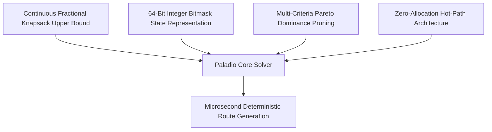

# Welcome to Paladio Core

**Paladio Core** (`paladio-core`) is an ultra-fast, deterministic C++20 combinatorial routing engine with zero-copy Python (`pybind11`) bindings, engineered to solve the **Time-Constrained Orienteering Problem with Time Windows (TCOPTW)**, financial budgets, and human-realism constraints.

---

## What is Paladio Core?

In operations research and autonomous logistics, the **Orienteering Problem** requires finding a path through a subset of locations to maximize the total collected reward (score) without violating a maximum travel budget or deadline. When each location additionally imposes an opening and closing window $[e_i, l_i]$, the problem becomes the **Time-Constrained Orienteering Problem with Time Windows (TCOPTW)**.

TCOPTW is strongly NP-hard. Exploring an $N$-node network requires evaluating $O(N!)$ candidate sequences. A naive solver evaluating $10^7$ nodes per second would require hundreds of thousands of years to evaluate 25 locations.

`paladio-core` solves 25-node networks in **1.3 milliseconds** and dense 64-node graphs in **sub-second to few-second runtimes** through a synergy of four mathematical and architectural principles:

1. **Continuous Fractional Knapsack Upper Bounding:** Computes an admissible linear relaxation in $O(N)$ at every search node to prune subtrees whose theoretical best possible score cannot beat the incumbent.
2. **Compact 64-Bit Bitmask State Encoding:** Encodes visited locations, mandatory visits, and meal states into `uint64_t` bitmasks, executing transitions via CPU hardware intrinsics (`std::countr_zero`).
3. **Multi-Criteria Pareto Dominance Pruning:** Caches explored states and aggressively prunes dominated paths that arrive later, at higher cost, or with lower score.
4. **Zero-Allocation Hot-Path Architecture:** Keeps all search states, recursion frames, and path histories in pre-allocated, contiguous stack memory. Zero `malloc` or `new` calls occur during branch-and-bound recursion.

---

## Documentation Navigation (Diátaxis Framework)

This documentation is organized into four complementary categories:

- **[Tutorials](tutorials/quickstart-python.md):** Hands-on, step-by-step guides to get up and running with Python or modern C++ in 5 minutes.
- **[How-To Guides](how-to/cmake-fetchcontent.md):** Focused recipes addressing specific practical tasks, such as CMake `FetchContent` linking, tuning human fatigue and meal spacing, and compiling with AddressSanitizer.
- **[Algorithmic Theory](theory/problem-formulation.md):** Deep dives into the mathematical formulation of TCOPTW, the admissibility proof of fractional knapsack upper bounding, and 64-bit mask mechanics.
- **[API Reference](reference/cpp-api.md):** Exhaustive technical reference for C++20 structs, methods, parameters, error types, and Python bindings.

Check out our empirical [Benchmarks & Performance Analysis](benchmarks.md) to see measured latencies and pruning ratios across varying graph scales.
